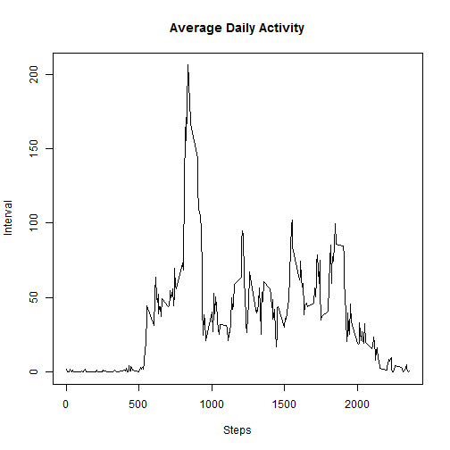

Loading and preprocessing the data
---

```r
library(dplyr)
```


```r
setwd("~/Coursera/ReproducibleResearch/Project1")
ds <- read.csv("repdata-data-activity/activity.csv", header=TRUE, sep=",")
summary(ds)
```

```
##      steps                date          interval     
##  Min.   :  0.00   2012-10-01:  288   Min.   :   0.0  
##  1st Qu.:  0.00   2012-10-02:  288   1st Qu.: 588.8  
##  Median :  0.00   2012-10-03:  288   Median :1177.5  
##  Mean   : 37.38   2012-10-04:  288   Mean   :1177.5  
##  3rd Qu.: 12.00   2012-10-05:  288   3rd Qu.:1766.2  
##  Max.   :806.00   2012-10-06:  288   Max.   :2355.0  
##  NA's   :2304     (Other)   :15840
```

```r
ds$Date <- as.Date(ds$date)
```

What is mean total number of steps taken per day?
---

```r
df1 <- ds %>%  
    na.omit() %>%
    group_by(Date)  %>%
    summarize(total_steps=sum(steps))
hist(df1$total_steps, main="Histogram of Total number of Steps By Day", 
     xlab="Steps", ylab="Freq")
```

 

Calculate and report the mean and median of the total number of steps taken per day
---

```r
summary(df1)
```

```
##       Date             total_steps   
##  Min.   :2012-10-02   Min.   :   41  
##  1st Qu.:2012-10-16   1st Qu.: 8841  
##  Median :2012-10-29   Median :10765  
##  Mean   :2012-10-30   Mean   :10766  
##  3rd Qu.:2012-11-16   3rd Qu.:13294  
##  Max.   :2012-11-29   Max.   :21194
```

```r
round(mean(df1$total_steps))
```

```
## [1] 10766
```

```r
round(median(df1$total_steps))
```

```
## [1] 10765
```
The mean with NA excluded is 10,766 steps.
The median with NA excluded is 10,765 steps.

What is the average daily activity pattern?
---

```r
df2 <- ds %>%  
    na.omit() %>%
    group_by(interval)  %>%
    summarize(avg_steps=mean(steps))
summary(df2)
```

```
##     interval        avg_steps      
##  Min.   :   0.0   Min.   :  0.000  
##  1st Qu.: 588.8   1st Qu.:  2.486  
##  Median :1177.5   Median : 34.113  
##  Mean   :1177.5   Mean   : 37.383  
##  3rd Qu.:1766.2   3rd Qu.: 52.835  
##  Max.   :2355.0   Max.   :206.170
```

```r
plot(df2$interval, df2$avg_steps, type="l", main="Average Daily Activity", xlab="Steps", ylab="Interval")
```

 

5-minute interval across all the days in the dataset that contains the maximum number of steps
---

```r
df2$interval[which.max((df2$avg_steps))]
```

```
## [1] 835
```

Inputing missing values
---
Calculate and report the total number of missing values in the dataset

```r
sum(is.na(ds$steps))
```

```
## [1] 2304
```

Devise a strategy for filling in all of the missing values in the dataset and create a new dataset that is equal to the original dataset but with the missing data filled in.


```r
df3 <- ds
for(x in 1:nrow(df3)){
    if(is.na(df3$steps[x])){
        df3[x,1] <- df2[df2$interval == df3[x,3],2]       
    }
}
```
***Missing values are replaced with the mean for that 5-minute interval.***

Make a histogram of the total number of steps taken each day and Calculate and report the mean and median total number of steps taken per day


```r
df4 <- df3 %>%  
    group_by(Date)  %>%
    summarize(total_steps=sum(steps))
hist(df4$total_steps, main="Histogram of Total number of Steps By Day", 
     xlab="Steps", ylab="Freq")
```

 

```r
summary(df4)
```

```
##       Date             total_steps   
##  Min.   :2012-10-01   Min.   :   41  
##  1st Qu.:2012-10-16   1st Qu.: 9819  
##  Median :2012-10-31   Median :10766  
##  Mean   :2012-10-31   Mean   :10766  
##  3rd Qu.:2012-11-15   3rd Qu.:12811  
##  Max.   :2012-11-30   Max.   :21194
```

```r
round(mean(df4$total_steps))
```

```
## [1] 10766
```

```r
round(median(df4$total_steps))
```

```
## [1] 10766
```
The rounded mean with missing values filled in is 10,766 steps.
The rounded median with missing values filled in is 10,766 steps.  
By filling in missing values with the mean for the same 5-day interval does not change the overall average, but the median increases by 1 step.

Are there differences in activity patterns between weekdays and weekends?
---
Create a new factor variable in the dataset with two levels - "weekday" and "weekend"

```r
df3$date_type[weekdays(df3[,4]) %in% c("Saturday","Sunday")]<-'Weekend'
df3$date_type[weekdays(df3[,4]) %in% c("Monday","Tuesday","Wednesday","Thursday","Friday")]<-'Weekday'
```

Make a panel plot containing a time series plot (i.e. type = "l") of the 5-minute interval and the average number of steps taken, averaged across all weekday days or weekend days.


```r
library(ggplot2)
df5<-df3 %>%
    group_by(interval, date_type)  %>%
    summarize(avg_steps=mean(steps))

g <- ggplot(df5, aes(interval, avg_steps))
g +  facet_wrap(~date_type, ncol=1)  + geom_line(aes(group=date_type, color=date_type))  +  theme_bw() + labs(y="Number of Steps") + labs(x="Interval")
```

 

```r
summary(df5$avg_steps[df5$date_type=="Weekday"])
```

```
##    Min. 1st Qu.  Median    Mean 3rd Qu.    Max. 
##   0.000   2.247  25.800  35.610  50.850 230.400
```

```r
summary(df5$avg_steps[df5$date_type=="Weekend"])
```

```
##    Min. 1st Qu.  Median    Mean 3rd Qu.    Max. 
##   0.000   1.241  32.340  42.370  74.650 166.600
```

There are slightly differences in activity patterns between weekdays and weekends:  
* During these observations the subjects took the most number of steps in given interval during the weekday, but in general they are are more active throughout the day during the weekends.  
* The subjects took approx. 7 steps more during the weekends.


library(knitr)
knit2html("PA1_template.Rmd", "PA1_template.html")

